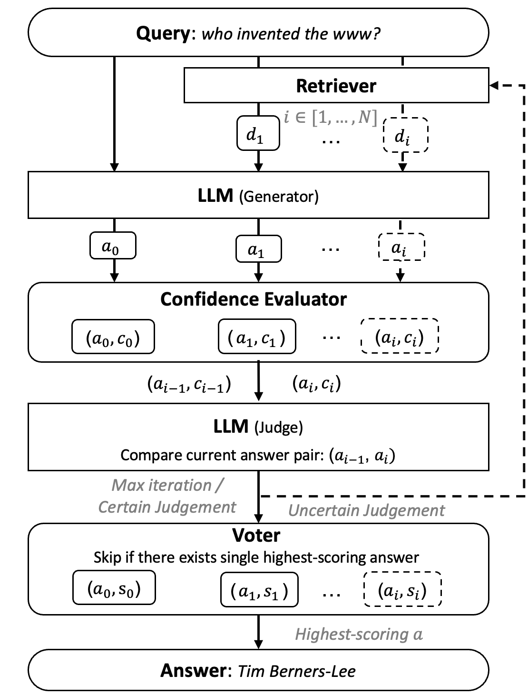

# S2RAG
S2RAG: Self-reflection and Self-voting RAG

## Overview
S2RAG is a framework designed to enhance retrieval-augmented generation (RAG) by incorporating self-reflection and self-voting mechanisms. This approach aims to improve both the efficiency and accuracy of generated responses by leveraging metrics like BERTScore and confidence levels during the RAG process.



## Data
- Provide two examples with the first 100 datapoints (PQA & ARC) for illustration.
- The full-sized data used for Judge training is provided in `data_training/train_data_fusion_w_exp.jsonl` and `data_training/train_data_fusion.jsonl`.
- The trained Judge is provided in `weights_minqi/llama3_8B_256/`

## Folder Structure
```
S2RAG/
│
├── data_eval/
│   Original datasets including PopQA, TriviaQA, PubHealth and Arc-Challenge.
│
├── data_training/
│   Data used to train Judge.
│
├── minqi_inf_output/   
│   Experiment raw results (only include examples here due to NDA). 
│
├── model/
|   Huggingface models.
│
├── run_bash/
│   ├── finetune_lla3.sh
│   ├── run_cfd_se_EXAMPLE.sh
│   ├── run_explanation_collection_EXAMPLE.sh
│   ├── run_response_EXAMPLE.sh
│   ├── run_S2RAG_EXAMPLE.sh
│   ├── run_S2RAG_rm_cfd_EXAMPLE.sh
│   ├── run_S2RAG_rm_SJ_EXAMPLE.sh
│   ├── run_S2RAG_w_trained_judge_EXAMPLE.sh
│   ├── run_selfadpt_EXAMPLE.sh
│   
├── scripts/
│   ├── __pycache__/
│   ├── cfd_se_collection.py
│   ├── explanation_collection.py
│   ├── finetune_rmst_lla3.py
│   ├── metrics.py
│   ├── response_collection.py
│   ├── run_S2RAG_ablation_rm_cfd.py
│   ├── run_S2RAG_ablation_rm_SJ.py
│   ├── S2RAG_inf.py
│   ├── selfadpt_collection.py
│   ├── stage3_no_offloading_accelerate.conf
│   ├── stage3_no_offloading_accelerate.conf:Zone.Identifier
│   ├── tsfm_wrapper.py
│   ├── utils.py
│
├── weights_minqi/
│   ├── llama3_8B_256/
│       ├── open_instruct/
│       ├── adapter_config.json
│       ├── adapter_model.bin
│       ├── README.md
│       ├── special_tokens_map.json
│       ├── tokenizer_config.json
│       ├── tokenizer.json
│
├── README.md
│
├── analysis_EXAMPLE.ipynb
│
└── README.md
```

## Steps to Run
1. **Data Processing and Analysis**
   - All related scripts and notebooks are in `analysis_EXAMPLE.ipynb`.

2. **Collect Responses from Generator**
   - Run the following command:
     ```bash
     bash run_bash/run_response_EXAMPLE.sh
     ```

3. **Collect Adaptive Retrieval Data**
   - Run the following command:
     ```bash
     bash run_bash/run_selfadpt_EXAMPLE.sh
     ```

4. **Collect Confidence & Self-Evaluation Data**
   - Run the following command:
     ```bash
     bash run_bash/run_cfd_se_EXAMPLE.sh
     ```

5. **Run S2RAG (Based on collected responses from Step 1 for efficiency)**
   - Run the following command:
     ```bash
     bash run_bash/run_S2RAG_EXAMPLE.sh
     ```

6. **Run Ablation Tests on S2RAG**
   - a. Remove confidence evaluation:
     ```bash
     bash run_bash/run_S2RAG_rm_cfd_EXAMPLE.sh
     ```

   - b. Remove self-judgement:
     ```bash
     bash run_bash/run_S2RAG_rm_SJ_EXAMPLE.sh
     ```

   - c. Remove self-voting:
     - Directly use the results from Step 5, see details in `analysis_EXAMPLE.ipynb`.

7. **Training Judge**
   - a. Judgement Explanations Collection:
     - See details in `analysis_EXAMPLE.ipynb`.

   - b. Train Data Preparation:
     ```bash
     bash run_bash/run_explanation_collection_EXAMPLE.sh
     ```
     - See results shown in `analysis_EXAMPLE.ipynb`.

   - c. Test on Trained Judge (e.g. llama2 generator + trained llama3-based judge):
     ```bash
     bash run_bash/run_S2RAG_w_trained_judge_EXAMPLE.sh
     ```

## Acknowledgements
This project is a collaborative effort between the university and industry partners. Special thanks to all contributors and reviewers.
